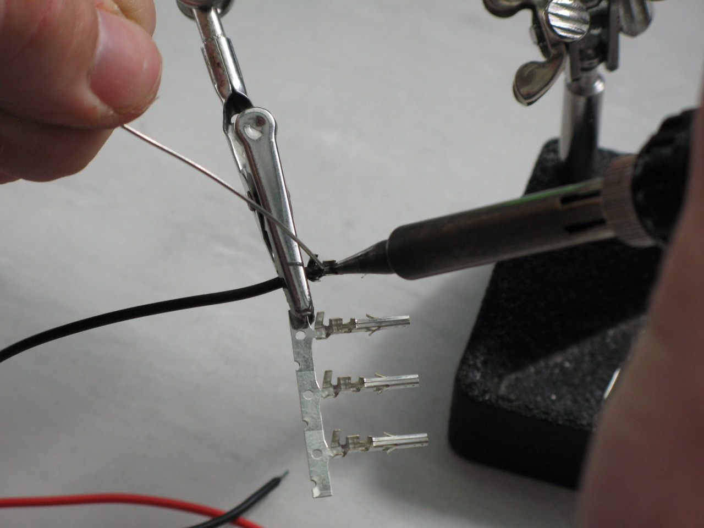
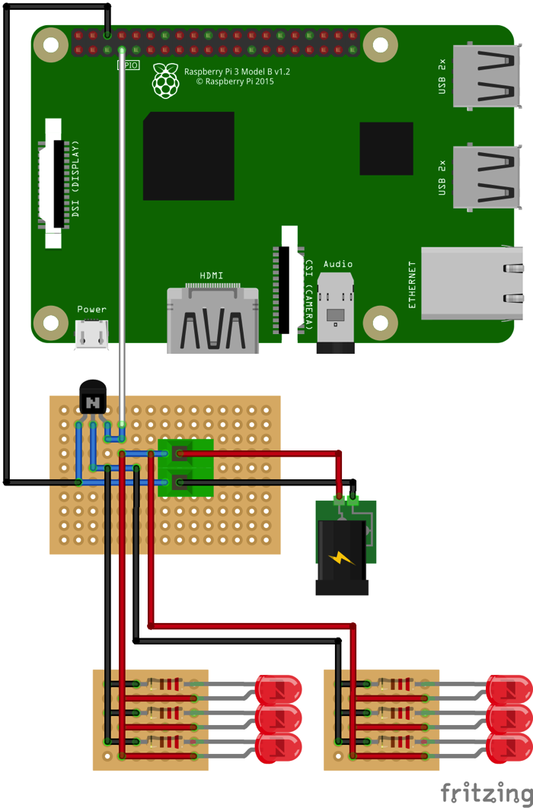

# Clamp & Switching Circuit Assembly Guide

## Parts

Quantity | Part | Additional information
---------|------|---------
1|3D-printed clamp housing parts (4 parts in total)|Models and more information available [here](http://opensourceov.org/).
1|3D-printed light box foot|Models and more information available [here](http://opensourceov.org/)
4|50mm Superbright LED light strips|Usually come in long strips that can be cut into smaller sections. Typically used for accent lighting in kitchens etc. Can be purchased online from a number of places - these are some from Jaycar - [Ultra Bright IP67 Waterproof LED Flexible Strip Light](https://www.jaycar.com.au/ultra-bright-ip67-waterproof-led-flexible-strip-light/p/ZD0579). Note **50mm** sections are required.
1|Raspberry Pi Camera v2 module| See RaspberryPi.org for [more information](https://www.raspberrypi.org/products/camera-module-v2/) and list of suppliers
1|Rasberry Pi Camera long cable| Although the Camera comes with a short cable, a long cable makes life much easier. Most Raspberry Pi suppliers should stock longer cables e.g. [Little Bird Electronics - Flex Cable for Raspberry Pi Camera - 18 / 457mm](https://littlebirdelectronics.com.au/collections/raspberry-pi-cables-headers/products/flex-cable-for-raspberry-pi-camera-18-457mm)
1|Moment 10x macro lens| Available from [Moment](https://momentlens.co/).
4|100mm lengths 25 AWG hookup cable (red)|
4|100mm lengths 25 AWG hookup cable (black)|
4|2.5mm x 8mm screws (flat head) and nuts|
4|3mm nuts|
4|3mm x ~35mm bolts|
4|5mm x ~75mm hex head bolts|
9|5mm nuts|
1|Sample pot of white acrylic paint|
1|Fine paintbrush|
4|5mm x ~80mm hex head bolts|
1|8mm x 90mm x 60mm (w x l x h) acrylic light diffuser (opaque plastic)
2|4-pin mini molex connector sets (each set containing a male and female connector)|e.g. [Jaycar - 4 Pin Mini Molex Plug/Socket](https://www.jaycar.com.au/4-pin-mini-molex-plug-socket/p/PP2027) or [Sparkfun - JST RCY Connector - Male/Female Set (2-pin)](https://www.sparkfun.com/products/10501) (but using 1 extra to make up the four connections required).
1|2-pin molex connector set (with both male and female connector)|e.g. [Jaycar - 2 Pin MULTI Pin Plug / Socket](https://www.jaycar.com.au/2-pin-multi-pin-plug-socket/p/PP2020)
1|TIP122 NPN transistor| e.g. [Jaycar - TIP122 NPN Transistor](https://www.jaycar.com.au/tip122-npn-transistor/p/ZT2292). Datasheet available here - [TIP122-datasheet](./resources/TIP122-datasheet.pdf).
1|100mm length 25 AWG hookup cable (white)
3|100mm length 25 AWG hookup cable (black)
2|100mm length 25 AWG hookup cable (red)
1|100mm length 18 AWG DC power cable (red)
1|100mm length 18 AWG DC power cable (black)
1|100m+ length 18 AWG DC power cable (red)
1|1000+ length 18 AWG DC power cable (black)
1|2-way PCB mount screw terminal| e.g [Sparkfun - Screw Terminals 2.54mm Pitch (2-Pin)](https://www.sparkfun.com/products/10571)
1|PCB|"Links" and "Strips" version is being used here e.g. [Little Bird - Ultra Mini Experimenters Board](https://littlebirdelectronics.com.au/products/ultra-mini-experimenters-board)
2|Jumper leads with at least one male (plug) connector (1 black, 1 white)|Can usually only buy these in packs e.g. [Spark fun - Jumper Wires Premium 6" M/F Pack of 10](https://www.sparkfun.com/products/9140)
2|~20mm sections of heatshrink tubing (~3mm diameter)|Usually purchased in longer lengths or in packs e.g. [Spark fun - Heat Shrink Kit](https://www.sparkfun.com/products/9353)

## Tools

Tool|Additional info|
---|-----
Soldering iron|
Solder|
Wire cutters| Flush / Diagonal cutters are particularly good e.g. [Spark fun - Flush Cutters](https://www.sparkfun.com/products/11952)
Small needle-nose pliers| e.g. [Spark fun - Needle Nose Pliers](https://www.sparkfun.com/products/8793)
Voltmeter| 
Third hand tool| e.g. [Spark fun - Third Hand](https://www.sparkfun.com/products/9317)

## Instructions

The 3D printed clamp housing consists of four parts:

* Camera mount
* Lens housing
* LED housing
* Spacer

1.  Solder 100mm lengths of 25 AWG red and black wires to the positive and negative terminals of one side of each 50mm light strip. Put two of the LED strips aside for later (to be used for the light box foot)

    
    

2.  For each LED strip section feed the wires through the hole, remove the adhesive backing label and stick the LED strip section in place.

    
    
    

3. Mount the camera using the four 8mm screws and nuts. Insert the screws from underneath to ensure there is enough clearance between the screws and the macro lens.

    
    
    
    
    

4. Insert four 3mm nuts into the four nut recesses in the LED housing

    

5. Insert the Moment macro lens into the lens recess in the LED housing

    

6. Hold the LED wires in place in the LED wires channel and add the lens housing ensuring that the two parts are joined flush.

    
    
    

7. Add the camera mount to the top. The camera lens sits slightly proud of the mount and should slot into the opening of the macro lens. Take special care to ensure the two are aligned. Turn the assembly over and look through the macro lens to check that the camera and lens are aligned. 

    Depending on the quality and accuracy of the 3D printer you may need to adjust one or more of the holes that mount the camera until the lens and camera are correctly aligned. A dissecting microscope can be helpful in ensuring alignment.

    

8. Screw the assembly together using the four 3mm x ~35mm bolts which will screw into the nuts inset in the LED housing. This should be done slowly and carefully to ensure that the camera is not forced into the top of the lens.

    
    

9. Attach the four 5mm x ~75mm bolts to the spacer through the underside and fix with four 5mm nuts on the top.

    
    
    

10. Screw on four additional 5mm nuts to be used as spacers.

    

11. Insert spacer into the main assembly.

    
    

12. Attach with a single 5mm nut.

    

13. Paint the inside of the light box foot and attach the two remaining LED strips to two of the faces and feed the wires through the holes. Note the image shows the light foot printed with a transparent plastic. Transparent material is not required. The most important thing is that the light well is painted with a reflective material such as white paint (acrylic-based works well).

    

14. Insert the four 5mm x ~80mm bolts through the underside of the light box foot.

    

15. Drill four holes in the diffuser, insert over the bolts and fix with four 5mm nuts. Tip: to mark where to drill the holes in the diffuser, align and hold the diffuser against the 3D printed foot then put it up against a light so you can see the holes shine through the diffuser plastic. Mark the centre of each hole with a marker then remove the diffuser, place on a flat piece of scrap wood and carefully drill through the diffuser into the wood. Gently is the key - acrylic sheets when drilled can easily shatter and crack.

    
    

16. Insert light box into main assembly.

    
    

17. Insert the camera cable.

    

### Wiring up the connectors

We have suggested to use 4-pin mini molex connectors to connect the lights to the light switching circuit and 2-pin molex (size up from mini) connectors to connect the light switching circuit to a 12v power supply. This makes connecting/reconnecting the lights and power supply easy and reduces the chance that a user will connect the terminals incorrectly (the connectors can only be inserted one way). However, they can be tricky to install. Common problems are listed at step 7. There are endless [other connectors](https://www.sparkfun.com/categories/91) if alternatives are needed/preferred.

1. Strip the ends of the eight LED wires (4 from the LED housing and 4 from the light box foot) leaving around 4mm of exposed wire. Only four of the eight wires are shown in the picture.

    

2. You can attach the wire to the pins using a crimping tool but a soldered connection is better. Do one pin at a time. Insert the wire part way into the pin as shown below and use a third hand clip to secure the wire to the pin while soldering.

    (picture required)

3. Add a small amount of solder to the tip of the soldering iron then push the tip into the pin so the solder touches the exposed wire (which is touching the pin). Leave for a brief moment so the iron (via the little bit of solder) heats the wires and pin. Now add more solder. The solder should flow in and around the wires. As soon as it does the remove the soldering iron. If the pin gets too hot then the wire insulation will melt, so the trick is to have the soldering iron heating the pin long enough so enough solder is added ensuring a good connection but not so long that the wire insulation melts and becomes a mess (it always melts a little). Make sure the solder stays within the pin channel. If you're having problems later inserting the pin into housing then this could be the problem. 

    
    

4. Remove the pin from the third hand clip (be careful it will be hot) and remove the unnecessary flap of metal at the base.

    

5. With the small needle-nose pliers fold the two flaps of metal inwards to hold the wire (alternatively crimp using a crimping tool).

    
    

6. Repeat for the remaining wires and pins, but only for the male or female connector, whichever you chose. Keep the partner for later.

7. Insert the pins one at a time into the housing. These can only go in one way but might need a little extra push with the pliers to get them to clip all the way in. If they're not going in, possible causes might be:

    * Too much solder has been applied to the wire 
    * There is solder outside the channel where the wire sits
    * The wire is too far in to pin
    * The pin is bent/deformed
    * The two little flaps on the side of the pin that clip into a groove in the housing to lock the pin in place have been damaged/deformed.

    It doesn't take much pin damage for it to be difficult/impossible to get these mini-molex pins into the housing. Unfortunately in most cases you just need to start again with a new set of connectors. The larger molex connectors that will be used for the power cable are easier and have a more obvious 'click' when you insert the pin into the housing, but for these you just need to ensure that the pin is all the way in and can't be pulled out when you try (but don't pull too hard!).

    

8. Done! You should have two mini-molex connectors left (male or female depending on what you installed). Put one aside to use with the switching circuit and keep the other as a spare.

    
    

### Switching circuit

For this particular version we have used a PCB with "links" and "strips" which takes care of the connections between the parts. There are many alternatives and the easiest would be to use a solderless [breadboard](https://www.sparkfun.com/products/12002), which does not require any soldering. However these are only good for prototyping and unsuitable for every day use because the parts and wires can easily pull out of the sockets. A number of good online guides for soldering are provided under 'Resources'.

This guide assumes you're building the circuit using the links and strips PCB. Use the following image as a reference for the wires and connection points.

1. Attach all the parts to the board except for the hookup cables. Bend the wires outward so the parts stay in their holes while soldering.

    

2. Solder all the connections.

    

3. Trim the ends.

    

4. Strip around 8mm of insulation from the end of the wires that connect from the Pi to the board and the board to the two LED strips (6 wires in total, only 4 shown) and twist the ends so they are easy to insert into the PCB holes.

    

5. Insert into the appropriate holes, bend outwards and solder.

    
    

6. Attach and solder the PCB mount screw terminal.

    

7. Strip about 10mm of insulation from the unstripped ends of the black and white wires that connect to the Pi and twist the exposed wire. Add the two sections of heatshrink (don't apply heat yet).

    
    

8. Remove one end of each of the two jumper leads leaving a female socket connector at one end of each (these will connect to the Pi GPIO pins). Strip about 10mm of insulation from the end.

    

9. Join the black and white jumper leads to the black and white hookup cable by twisting the wires around each other.

    

10. Suspend the wire connection using a third hand tool.

    

11. Apply some solder to the tip of a hot soldering iron and place it under the wound wires so the solder is touching the wires. Now move the hot iron back and forth along the wound wires while adding more solder to the top. This will thoroughly coat the wires and ensure a good connection.

    

12. Move the heatshrink over the soldered connection and heat to shrink.

    
    

13. Repeat for the other wire.

    

14. Attach the four wires (2 red, 2 black) that will connect to the LEDs to the unused female (or male) 4-pin mini-molex connector, following the same procedure as before. Make sure the terminals are matching (red to red, black to black) before you push the pins into their housing.

    
    

15. Strip 3-4mm of insulation from two of the 18 AWG wires (1 black, 1 red). These will be used to connect the power supply.

    

16. Install the male 2-pin molex connector. Same procedure as the 4-pin mini molex connector. With the larger molex connector it may be easier to crimp the two flaps of metal that hold the insulation in place (as shown here).

    
    
    
    

17. Strip 3-4mm of insulation from the other end of the two wires and insert into the PCB mount screw terminalensuring that the black wire is connected to the negative terminal and the red wire to the positive terminal as shown in the reference diagram above. 

    
    

17. Install the female connector on a second set of 18 AWG wires (1 red, 1 black). These wires can then be attached to a 12v battery.

    
    

18. Done!

    
    

