# Switching/LED Circuit Assembly Guide

## Parts

Quantity | Part | Additional information
---------|------|---------
4|100mm lengths 25 AWG hookup cable (red)|
4|100mm lengths 25 AWG hookup cable (black)|
2|4-pin mini molex connector sets (each set containing a male and female connector)|e.g. [Jaycar - 4 Pin Mini Molex Plug/Socket](https://www.jaycar.com.au/4-pin-mini-molex-plug-socket/p/PP2027) or [Sparkfun - JST RCY Connector - Male/Female Set (2-pin)](https://www.sparkfun.com/products/10501) (but using 1 extra to make up the four connections required).
1|2-pin molex connector set (with both male and female connector)|e.g. [Jaycar - 2 Pin MULTI Pin Plug / Socket](https://www.jaycar.com.au/2-pin-multi-pin-plug-socket/p/PP2020)
1|TIP122 NPN transistor| e.g. [Jaycar - TIP122 NPN Transistor](https://www.jaycar.com.au/tip122-npn-transistor/p/ZT2292). Datasheet available here - [TIP122-datasheet](./resources/TIP122-datasheet.pdf).
1|100mm length 25 AWG hookup cable (white)
3|100mm length 25 AWG hookup cable (black)
2|100mm length 25 AWG hookup cable (red)
1|100mm length 18 AWG DC power cable (red)
1|100mm length 18 AWG DC power cable (black)
1|100m+ length 18 AWG DC power cable (red)
1|1000+ length 18 AWG DC power cable (black)
1|2-way PCB mount screw terminal| e.g [Sparkfun - Screw Terminals 2.54mm Pitch (2-Pin)](https://www.sparkfun.com/products/10571)
1|PCB|"Links" and "Strips" version is being used here e.g. [Little Bird - Ultra Mini Experimenters Board](https://littlebirdelectronics.com.au/products/ultra-mini-experimenters-board)
2|Jumper leads with at least one male (plug) connector (1 black, 1 white)|Can usually only buy these in packs e.g. [Spark fun - Jumper Wires Premium 6" M/F Pack of 10](https://www.sparkfun.com/products/9140)
2|~20mm sections of heatshrink tubing (~3mm diameter)|Usually purchased in longer lengths or in packs e.g. [Spark fun - Heat Shrink Kit](https://www.sparkfun.com/products/9353)

## Tools

Tool|Additional info|
---|-----
Soldering iron|
Solder|
Wire cutters| Flush / Diagonal cutters are particularly good e.g. [Spark fun - Flush Cutters](https://www.sparkfun.com/products/11952)
Small needle-nose pliers| e.g. [Spark fun - Needle Nose Pliers](https://www.sparkfun.com/products/8793)
Voltmeter| 
Third hand tool| e.g. [Spark fun - Third Hand](https://www.sparkfun.com/products/9317)

## Instructions

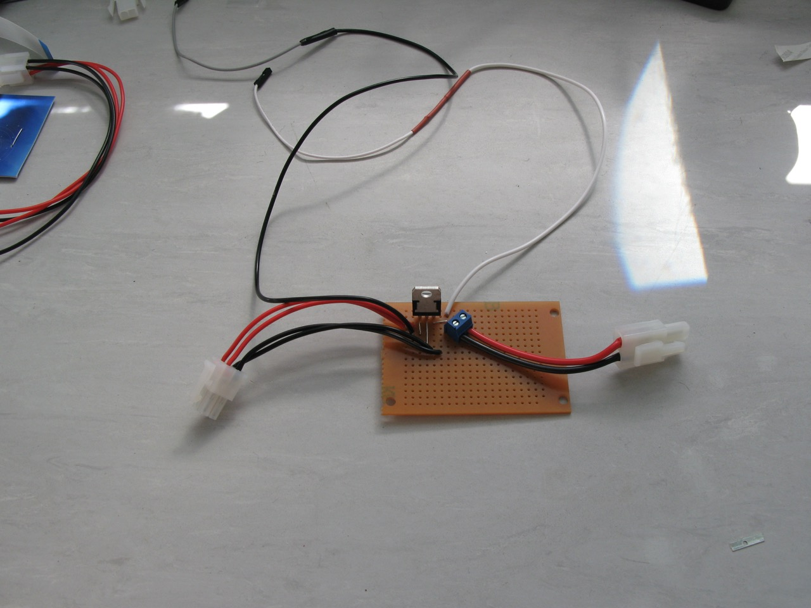

For this particular version we have used a PCB with "links" and "strips" which takes care of the connections between the parts. There are many alternatives and the easiest would be to use a solderless [breadboard](https://www.sparkfun.com/products/12002), which does not require any soldering. However these are only good for prototyping and unsuitable for every day use because the parts and wires can easily pull out of the sockets. A number of good online guides for soldering are provided at [http://www.opensourceov.org/resources/](http://www.opensourceov.org/resources/).

This guide assumes you're building the circuit using the links and strips PCB. Use the following image as a reference for the wires and connection points.

1. Attach all the parts to the board except for the hookup cables. Bend the wires outward so the parts stay in their holes while soldering.

    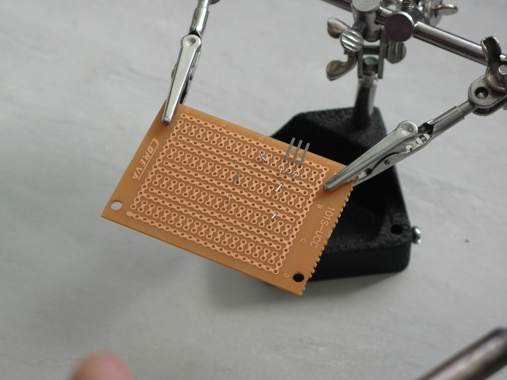

2. Solder all the connections.

    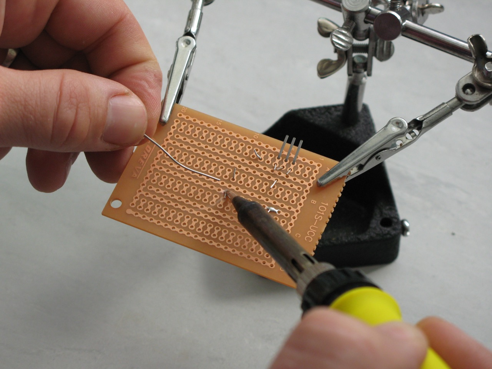

3. Trim the ends.

    

4. Strip around 8mm of insulation from the end of the wires that connect from the Pi to the board and the board to the two LED strips (6 wires in total, only 4 shown) and twist the ends so they are easy to insert into the PCB holes.

    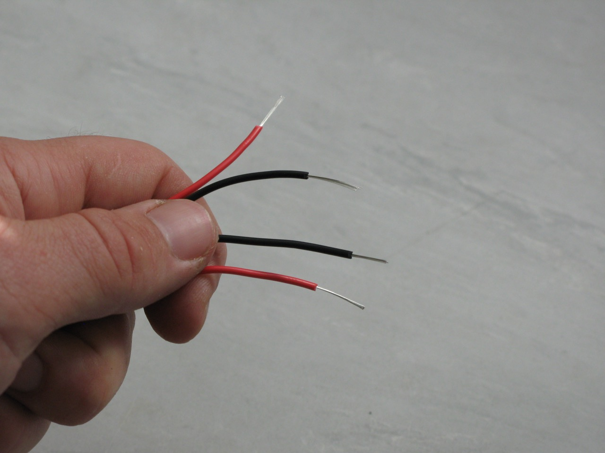

5. Insert into the appropriate holes, bend outwards and solder.

    
    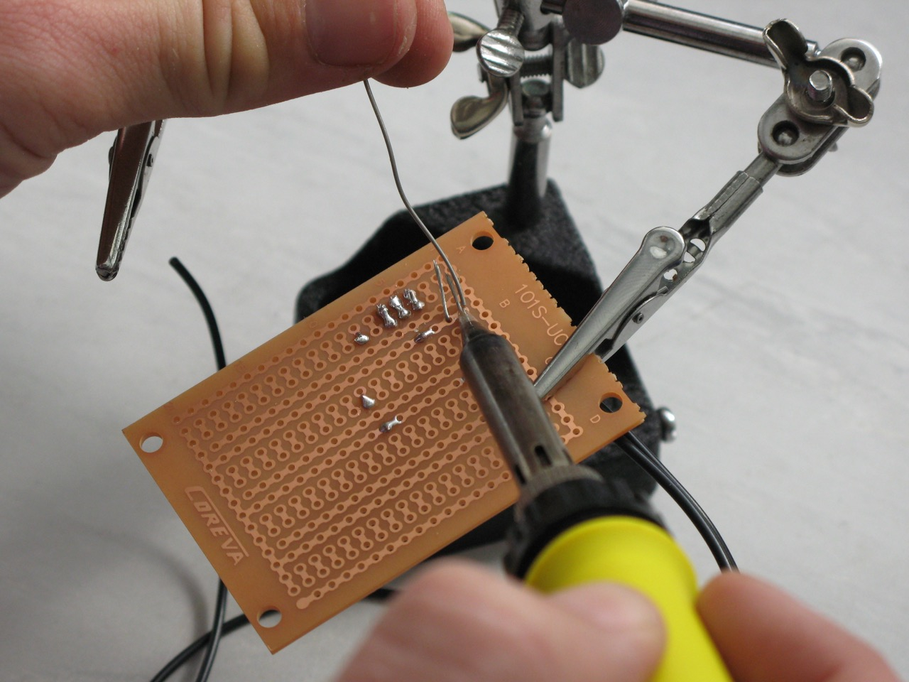

6. Attach and solder the PCB mount screw terminal.

    

7. Strip about 10mm of insulation from the unstripped ends of the black and white wires that connect to the Pi and twist the exposed wire. Add the two sections of heatshrink (don't apply heat yet).

    
    

8. Remove one end of each of the two jumper leads leaving a female socket connector at one end of each (these will connect to the Pi GPIO pins). Strip about 10mm of insulation from the end.

    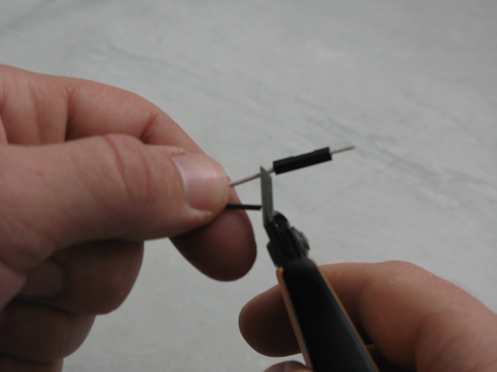

9. Join the black and white jumper leads to the black and white hookup cable by twisting the wires around each other.

    

10. Suspend the wire connection using a third hand tool.

    

11. Apply some solder to the tip of a hot soldering iron and place it under the wound wires so the solder is touching the wires. Now move the hot iron back and forth along the wound wires while adding more solder to the top. This will thoroughly coat the wires and ensure a good connection.

    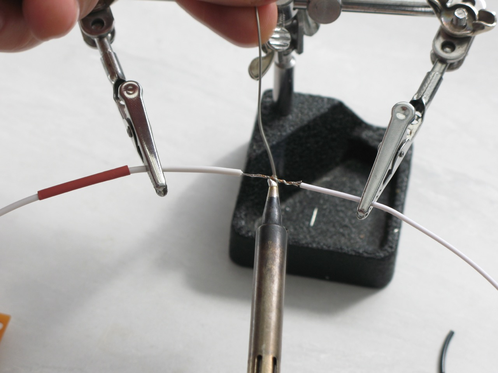

12. Move the heatshrink over the soldered connection and heat to shrink.

    
    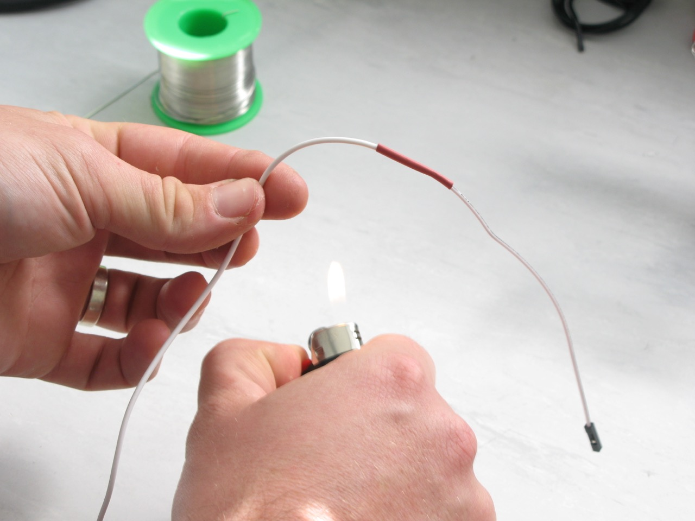

13. Repeat for the other wire.

    

14. Attach the four wires (2 red, 2 black) that will connect to the LEDs to the unused female (or male) 4-pin mini-molex connector, following the same procedure as before. Make sure the terminals are matching (red to red, black to black) before you push the pins into their housing.

    
    

15. Strip 3-4mm of insulation from two of the 18 AWG wires (1 black, 1 red). These will be used to connect the power supply.

    

16. Install the male 2-pin molex connector. Same procedure as the 4-pin mini molex connector. With the larger molex connector it may be easier to crimp the two flaps of metal that hold the insulation in place (as shown here).

    
    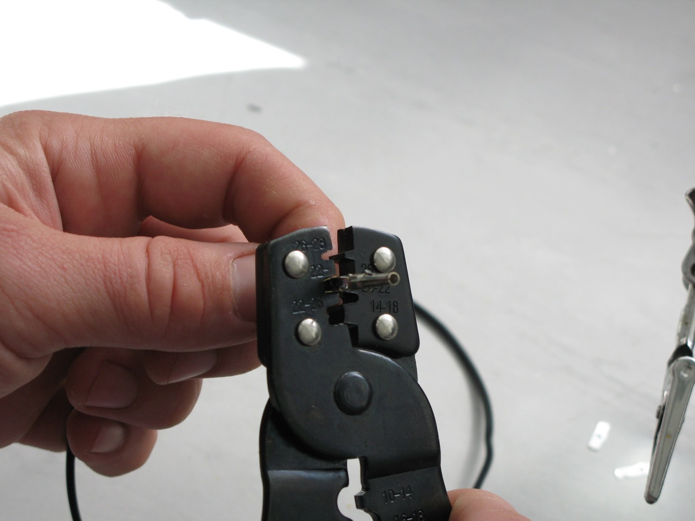
    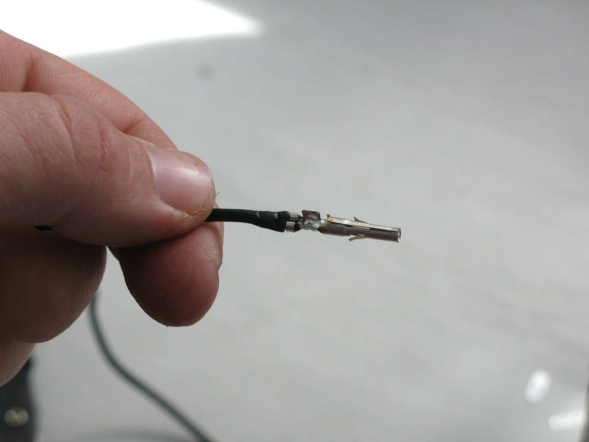
    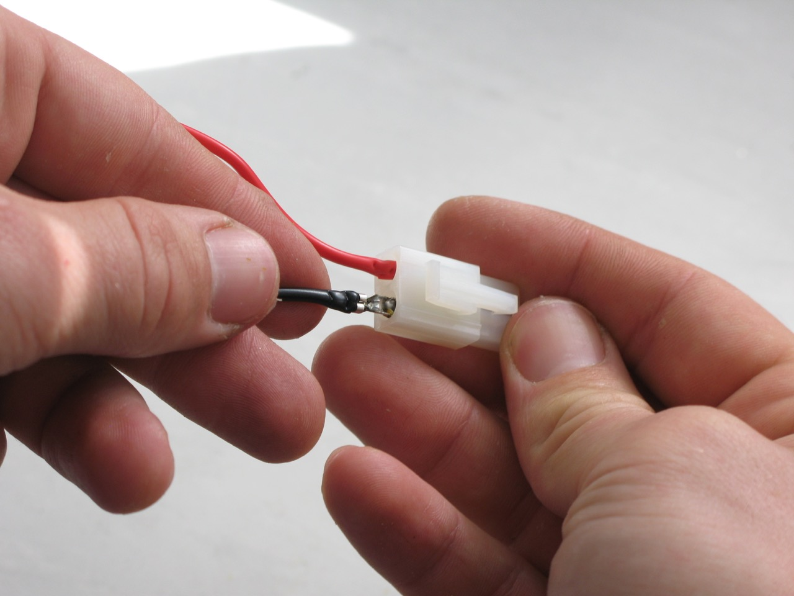

17. Strip 3-4mm of insulation from the other end of the two wires and insert into the PCB mount screw terminalensuring that the black wire is connected to the negative terminal and the red wire to the positive terminal as shown in the reference diagram above. 

    
    

17. Install the female connector on a second set of 18 AWG wires (1 red, 1 black). These wires can then be attached to a 12v battery.

    
    

18. Done!

    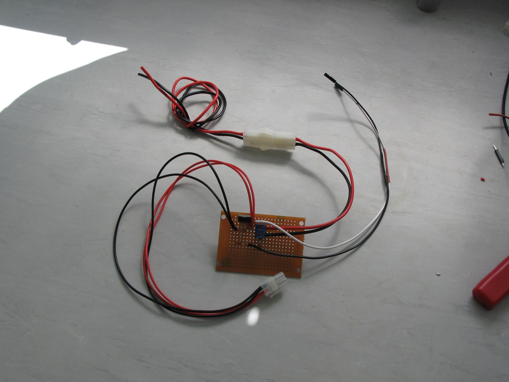

