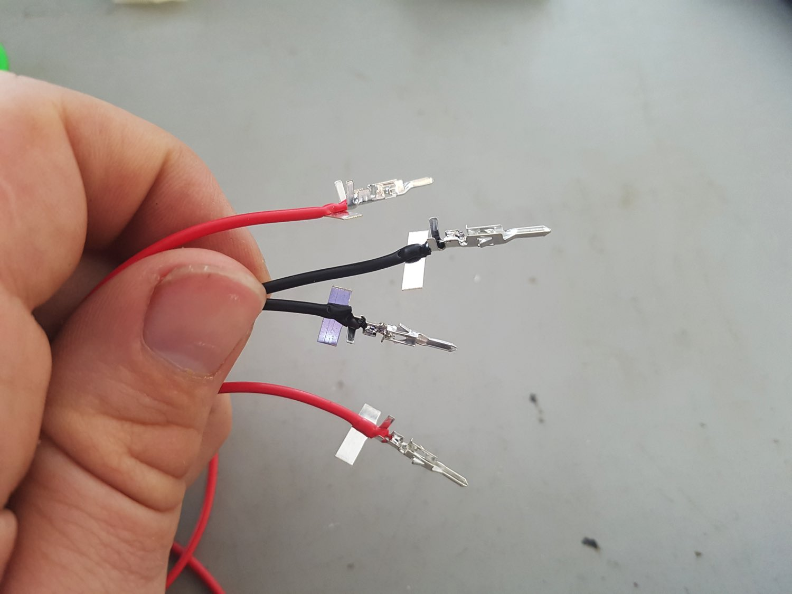
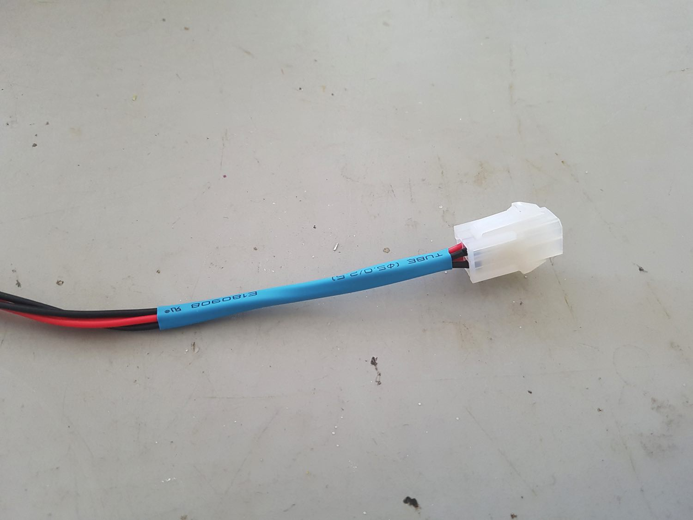
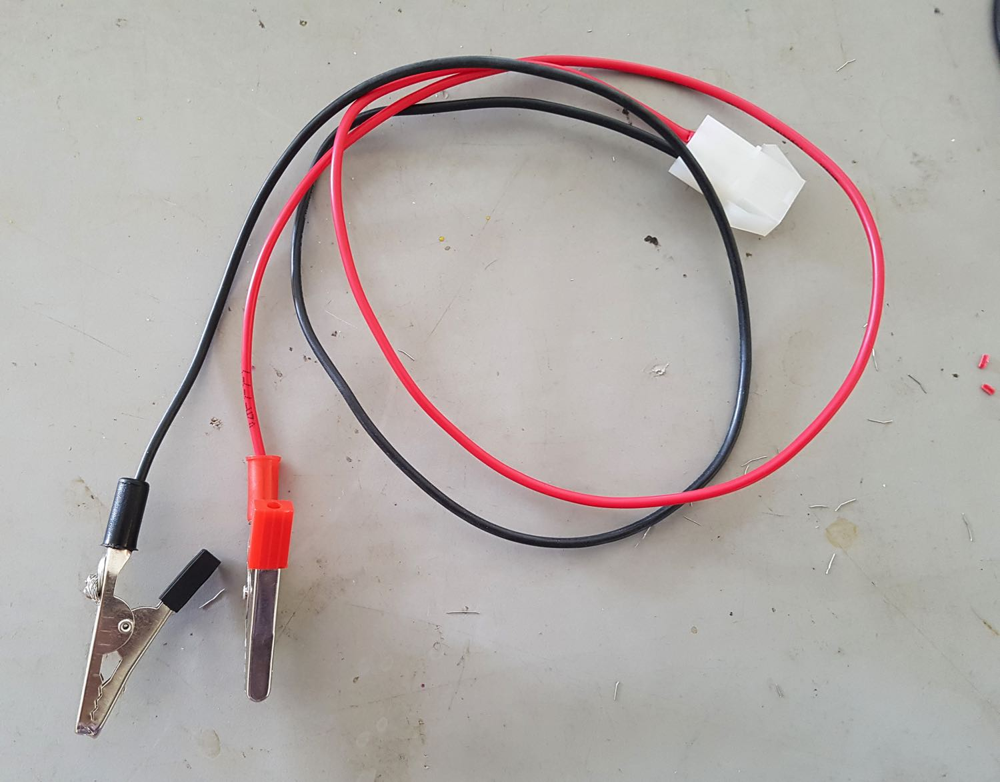

# Switching/LED Circuit (Version 2 - Inline Version) Assembly Guide

## Parts

Quantity | Part | Additional information
---------|------|---------
1|60mm length 18 AWG DC power cable (black)|
1|100mm length 18 AWG DC power cable (black)| Missing from picture below
1|100mm length 18 AWG DC power cable (red)|
1|300mm length 18 AWG DC power cable (black)|
1|300mm length 18 AWG DC power cable (red)|
1|300mm length 25 AWG hookup cable (white)|
2|300mm length 25 AWG hookup cable (red)|
3|300mm length 25 AWG hookup cable (black)|
2|Jumper leads with at least one male (plug) connector (1 black, 1 white)|Can usually only buy these in packs e.g. [Spark fun - Jumper Wires Premium 6" M/F Pack of 10](https://www.sparkfun.com/products/9140)

Quantity | Part | Additional information
---------|------|---------
2|4-pin mini molex connector sets (each set containing a male and female connector)|e.g. [Jaycar - 4 Pin Mini Molex Plug/Socket](https://www.jaycar.com.au/4-pin-mini-molex-plug-socket/p/PP2027) or [Sparkfun - JST RCY Connector - Male/Female Set (2-pin)](https://www.sparkfun.com/products/10501) (but using 1 extra to make up the four connections required).
1|2-pin molex connector set (with both male and female connector)|e.g. [Jaycar - 2 Pin MULTI Pin Plug / Socket](https://www.jaycar.com.au/2-pin-multi-pin-plug-socket/p/PP2020)
1|TIP122 NPN transistor| e.g. [Jaycar - TIP122 NPN Transistor](https://www.jaycar.com.au/tip122-npn-transistor/p/ZT2292). Datasheet available here - [TIP122-datasheet](./resources/TIP122-datasheet.pdf).
2|Large alligator clips (1 red 1 black)|e.g. [Jaycar - Alligator Clips](https://www.jaycar.com.au/alligator-clips-with-screw-pk-2/p/HM3025).
-|Multiple lengths of difference sized heatshrink| Available in kits (e.g. [Sparkfun - Heat Shrink Kit](https://www.sparkfun.com/products/9353)) but often cheaper to buy in long strips and cut yourself.

## Tools

Tool|Additional info|
---|-----
Soldering iron|
Solder|
Wire cutters| Flush / Diagonal cutters are particularly good e.g. [Spark fun - Flush Cutters](https://www.sparkfun.com/products/11952)
Small needle-nose pliers| e.g. [Spark fun - Needle Nose Pliers](https://www.sparkfun.com/products/8793)
Voltmeter| 
Third hand tool| e.g. [Spark fun - Third Hand](https://www.sparkfun.com/products/9317)
Heatgun or lighter| Used to heat the heatshrink.

## Instructions

1. Strip ~4mm of insulation from one end of the red and black 100mm length 18 AWG DC power cables and solder the 2-pin molex pins, one for each wire.

    
    
    
    
    
    

    See the [Wiring Connectors Guide](./wiring-connectors.md) for additional information.

2. Splay the pins of the TIP122 transistor.

    
    

3. Strip ~10mm of insulation from one end of the white hookup cable, twist then wrap around pin 1 (base) - the leftmost pin when viewing the TIP122 transistor from the front. See the [TIP122 datasheet](./resources/TIP122-datasheet.pdf) for more information.

    

4. Support the transistor and solder the cable to the pin. The trick here is not to heat the pin (and transistor) for too long but a good soldered connection is still required.

    
    

5. Strip ~10mm of insulation from one end of the two 100mm lengths of black hookup cable. Twist the ends then wrap each cable around the middle pin (collector) and solder.
    
    
    
    

6. Strip ~10mm of insulation from the one end of the black 60mm black power cable and wrap around the remaining pin (emitter). Solder.
    
    
    
    

7. Using wire-cutters remove any excess wires and generally clean up the pins

  (pictured required)

8. Add appropriate heatshrink sections, apply heat, and push the pins back together (from their splayed positions). Try and get the heatshrink as high up the pins as possible so the entire pin is insulated.

    
    

9. Align the transistor assembly with the power cable assembly so there is a gap of ~50mm between the transistor and the molex connector. Cut the black earth cable from the molex connector and the black cable connected to the emitter (pin 3) and remove ~15mm of insulation. 

    
    
    
10. Remove ~15mm from the remaining 300mm length of black hookup cable. Twist and wrap the hookup and power cable as shown and solder. Soldering a large bundle of wires like this can be tricky. You need to get enough heat into the cable for the solder to flow so you need a clean soldering iron tip that is properly tinned to maximise heat transfer. If you can't get a good connection with solder then use some wire connectors. Add heatshrink to insulate.

    
    
    
    

11. Remove ~15mm insulation from the two remaining 300mm lengths of red hookup cable and the end of the red power cable coming from the molex connector. Twist as shown and solder. Apply heatshrink.

    
    
    
    

12. At this point you should have something that looks like this:

    

13. Strip ~4mm from the ends of all of the hookup cables (not the power cables) EXCEPT the hookup cable connected to pin 3 (emitter) of the transistor.

    

14. Attach and solder a molex pin from the male or female 4-pin molex connector. Don't insert into the molex connector just yet. 

    
    
    

15. Measure up an appropriate length of large heatshrink to cover the bulk of the transistor and wires (~100-150mm section). Cut, insert the wires, and heat shrink.

    
    
    

16. Insert the 4 wires with the molex pins into another length of appropriately sized heatshrink (~100mm).

    

17. Now insert the pins into the 4-pin molex connector and heat shrink.

    

18. Cut the two jumper leads at the female end leaving ~ 15mm of wire. Strip ~8-10mm of insulation from the ends.

    
    
    

19. You should now have two hookup wires (the thinner wires) remaining - a white wire coming from the transistor and a black wire coming from the molex connector. Insert the wires through two ~20mm lengths of heatshrink - one black and one white if you can to match the wire colours.

    

20. Strip ~10mm insulation from the ends and attach the jumper leads by twisting the wires together. Move the heatshrink as far away from the twisted wires as possible then solder. If the heatshrink is too close it will shrink when you solder! Once soldered move the heatshrink back up and over the connection and heat shrink.

    
    
    
    

21. At this point you should have something that looks like this:

    

22. Now to construct the power leads:

    

23. Strip ~5mm of insulation from the ends of the two remainin 300mm lengths of power cable (black and red).

    

24. Attach the pins for the male/female (depends what you used in step 1) 2-pin molex connector

    

25. Insert the pins into the 2-pin molex connector. Tip: insert the connector part way into its mating connector (as you can see in the pic) and then insert the pins. This way you can make absolutely sure that you are meeting red with red and black with black. Once the molex connectors are in they are near impossible to get out without a special tool (and even then you'll probably damage the pins).

    

26. Strip ~15mm from the other end of the power cable, twist, and thread through the clip cap/sleeve as shown. Bend ~4mm of the end to help you fit the wire into the clip.

    

27. Thread the cable through the clip hole (this will be easier with the ~4mm bend) and wrap around the screw and tighten.
    
    

28. Apply some solder to the cable and clip to ensure a good connection. Only a little blob of solder on one side is needed.
    
    

29. Repeat for the other power cable. Bring up and fix the clip caps/sleeves.

30. Done! Go get a beer and marvel at your work.

    
