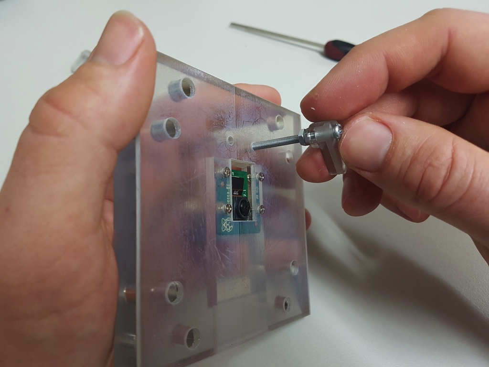
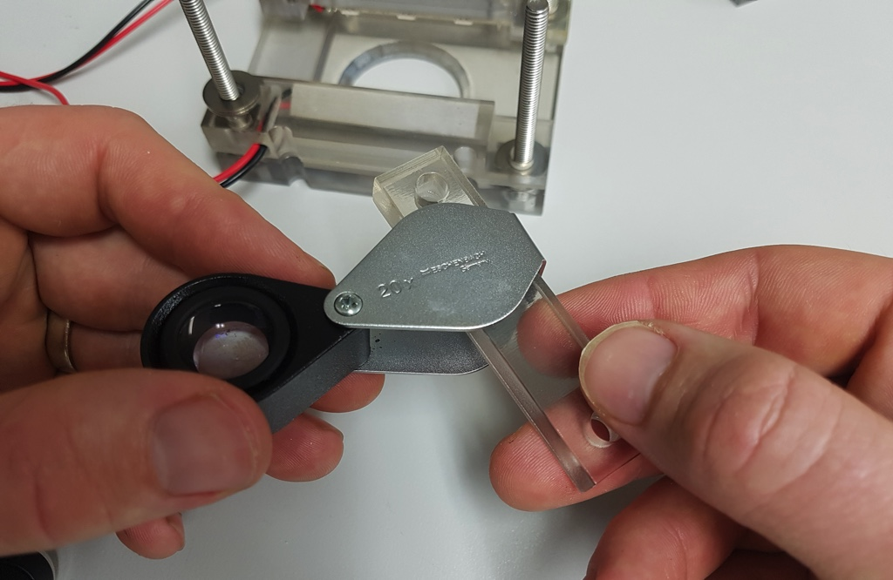

# Clamp Version 2 Assembly Guide

## Schema

* **Camera mount** - to mount the camera and bolt the assembly together to the base
* **Lens clamp spacers** - used to increase the space between the top of the hand lens case and the bottom of the camera mount. Most hand lenses have a screw that sits proud and attaches the lens to the case. Without an appropriate spacer the hand lens sits at an angle. Only one need be used.
* **LED mounts** - to mount the LED strips. A wider mount to be used with most hand lenses and thinner mounts if more space is needed for a wider hand lens. Only one mount set is used (thin or wide).
* **Lens lock** - to hold the lens in place. Most lenses are firmly fixed to the case and don't move so these are normally not required.
* **Spacer** - to keep the sample in place and set the distance between hand lens and sample.
* **Illuminated base** - to provide the source of transmitted light and base for bolting the assembly together (diffuser layer not shown, more details below)

## Parts

Quantity | Part | Additional information
---------|------|---------
1|3D-printed clamp parts|Models and more information available in the [Clamp 3D Printing Resources](https://github.com/OpenSourceOV/clamp-3d-printing-resources) repository.
6|50mm Superbright LED light strip sections|For the LED mounts and illuminated base. Usually come in long strips that can be cut into smaller sections. Typically used for accent lighting in kitchens etc. Can be purchased online from a number of places - these are some from Jaycar - [Ultra Bright IP67 Waterproof LED Flexible Strip Light](https://www.jaycar.com.au/ultra-bright-ip67-waterproof-led-flexible-strip-light/p/ZD0579). Note **50mm** sections are required.
1|Raspberry Pi Camera v2 module| See RaspberryPi.org for [more information](https://www.raspberrypi.org/products/camera-module-v2/) and list of suppliers
1|Rasberry Pi Camera long cable| Although the Camera comes with a short cable, a long cable makes life much easier. Most Raspberry Pi suppliers should stock longer cables e.g. [Little Bird Electronics - Flex Cable for Raspberry Pi Camera - 18 / 457mm](https://littlebirdelectronics.com.au/collections/raspberry-pi-cables-headers/products/flex-cable-for-raspberry-pi-camera-18-457mm)
1|Hand lens (loupe)|10-20 magnification e.g. [Eschenbach 20x hand lense](https://www.magnifyingaids.com/Eschenbach_20X_Aplanatic_Loupe_Magnifier) is excellent.
6|100mm lengths 25 AWG hookup cable (red)| For the LED mounts and illuminated base.
6|100mm lengths 25 AWG hookup cable (black)| For the LED mounts and illuminated base.
1|Sample pot of white acrylic paint| For the illuminated base.
1|Small paintbrush| For the illuminated base.
1|8mm x 90mm x 90mm (w x l x h) acrylic light diffuser (opaque plastic)|For the illuminated base.
4|5mm x ~70mm mushroom (or other) head bolts| For the illuminated base.
4|5mm x ~60mm hex head bolts| For the top assembly.
16+|5mm nuts| For the top assembly.
20+|5mm washers| For the top assembly.
4|2.5mm x 8mm screws (flat head)| For the camera mount.
4|2.5mm nuts| For the camera mount.
6|3mm nuts| For the lens locks.
2|3mm washers| For the lens locks.
2|~35mm x 3mm bolts| For the lens locks.
3|4-pin mini molex connector sets (each set containing a male and female connector)|e.g. [Jaycar - 4 Pin Mini Molex Plug/Socket](https://www.jaycar.com.au/4-pin-mini-molex-plug-socket/p/PP2027) or [Sparkfun - JST RCY Connector - Male/Female Set (2-pin)](https://www.sparkfun.com/products/10501) (but using extra to make up the connections required). For the LED mounts and illuminated base.

## Tools

Tool|Additional info|
---|-----
Soldering iron|
Solder|
Wire cutters| Flush / Diagonal cutters are particularly good e.g. [Spark fun - Flush Cutters](https://www.sparkfun.com/products/11952)
Small needle-nose pliers| e.g. [Spark fun - Needle Nose Pliers](https://www.sparkfun.com/products/8793)
Voltmeter/Multimeter| 
Third hand tool| e.g. [Spark fun - Third Hand](https://www.sparkfun.com/products/9317)

## Instructions

1. Paint the light well of the illuminated base white and leave to dry.

    
    

2. Solder 100mm lengths of 25 AWG red and black wires to the positive and negative terminals of one side of each 2 50mm light strips.

    

3. Feed the wires through the holes at one end of the illuminated base, remove the adhesive backing labels and stick the LED strip sections in place as shown.

    

4. Insert a 5mm nut in a nut recess in the illuminated base, turn over and screw through a 5mm x ~80mm bolt. Repeat for the other 3 recesses.

    
    
    

5. Drill four holes in the diffuser and insert over the illuminator bolts. Tip: to mark where to drill the holes in the diffuser, align and hold the diffuser against the 3D printed foot then put it up against a light so you can see the holes shine through the diffuser plastic. Mark the centre of each hole with a marker then remove the diffuser, place on a flat piece of scrap wood and carefully drill through the diffuser into the wood. Gently is the key - acrylic sheets when drilled can easily shatter and crack.

    
    

6. Make sure the wires aren't caught between the diffuser and base, but sitting properly in the gap.

    

7. Connect either male or female mini-molex connectors to the end of the wires. See [Wiring Connectors](./wiring-connectors.md) for more details.

8. Insert the spacer between the bolts and trace around the edge of the hole with a pencil or marker to provide a guide for sample positioning. Set the illuminated foot aside.

    
    

9. Assemble the lens locks as shown.

    
    

10. Mount the Raspberry Pi camera to the camera mount (see [Version 1 instructions](./version-1.md) for more details on camera mounting) and attach the lens locks.

    

9. Insert 4 5mm x ~60mm hex head bolts through the underside of the spacer and set the assembly flat on the bench to keep the bolts from falling out.

    
    

9. Add none or 1 or 2 washers to each of the four bolts. The number of washers set the distance between the overhead illumination (the LEDs) and the sample. Whether to use none, or 1, or 2 depends on the position of the lens, which in turn depends on the lens working distance (distance between the lens and the object in focus), which will be different for each hand lens. The goal is to have the LEDs angled perfectly at the center of the spacer hole and not be obstructed by the lens. Trial and error will determine the best configuration. See [Configuration for larger working distances](#configuration-for-larger-working-distances) for an example of an alternative configuration.

    

10. Solder the LED strips and attach to the thin and wide LED mounts. Whether to use the thin or wide mounts in the final assembly depends on the hand lens. The thin LED mounts provide maximum space to accommodate a wider hand lens but comes at the cost of pushing the LEDs away from the lens and increasing the angle of reflection i.e. less direct light hitting the lens. Whether or not this makes any difference to the clarity of embolism events has yet to be tested but maximising direct light intuitively seems better, hence the wider LED mounts which position the LEDs closer to the lens.

    Solder 100mm lengths of 25 AWG red and black wires to the positive and negative terminals of one side of each 50mm light strip. Feed the wires through the holes in the LED mounts and stick the LED strips in place as shown.

    
    

7. Connect mini-molex connectors to the end of the wires. Use the same connector (male or female) as used for the illuminated base wires. See [Wiring Connectors](./wiring-connectors.md) for more details.

11. Add the wide or thin LED mounts to the spacer.

    

12. Fix two 5mm nuts to the rear bolts and add two (or less/more) washers to each to act as spacers. These spacers provide support to the camera mount when bolting the assembly together. These may need to be adjusted - more detail in subsequent steps.

    

13. Open the hand lens and insert the lens clamp through the lens housing as shown.

    
  
14. Insert hand lens and clamp over the front bolts

    

15. Add a washer to each front bolt. These washers stop the lens clamp from bending when the assembly is tightly bolted. Ideally they should be slightly thinner than the thickness of the lens housing. If the lens housing is very thin then omit the washers completely.
    
    

16. Add a lens clamp spacer. The spacer ensures the screw that fixes the hand lens to the case doesn't touch the camera mount. For the hand lens shown the screw only sits slightly proud of the case so a 1mm spacer has been used.

    

17. Add the camera mount to the assembly. Note the hand lens will still be loose at this stage.

    

18. Add 5mm washers and bolts to the protruding bolts and **lightly tighten** - needs to be loose enough to adjust the hand lens.

    
    

19. Move the hand lens to roughly in the center (loosen the bolts if it can't be moved). The assembly should look something like this at this point:

    
    

20. Turn the assembly over and position the lens so the Raspberry Pi camera is in the center.

    View of the underside without the lens locks:
    

    With the lens locks:
    

21. Adjust the lens locks using a screwdriver or pencil so they touch the sides of the hand lens. 

    

21. Tighten the bolts to lock the lens case in position.

    

22. Tighten the lens lock bolts to lock the lens in position. You may need to hold the lens locks in position while tightening.

    

23. The assembly should now look something like this:

    
    
    

22. Insert the illuminated base into the top assembly and loosely attach the wing nuts (or bolts) ready for application.

    

23. Insert the Raspberry Pi camera cable through the cable gap in the mount and lock into the camera board.

    
    
    

    To detach the cable use a pair of needle-nosed/pinch pliers:

    

24. Done!

## Configuration for larger working distances

For hand lenses with a larger working distance, such as a 10x magnification hand lens, the space between the lens and the spacer must be increased. This can be achieved using additional bolts and washers as shown below:

Note that in these shots the two rear nuts are being moved up to meet the camera mount. This is important beacuse they provide support to the camera mount when the base is bolted to the top assembly while capturing.

