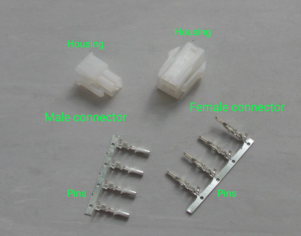
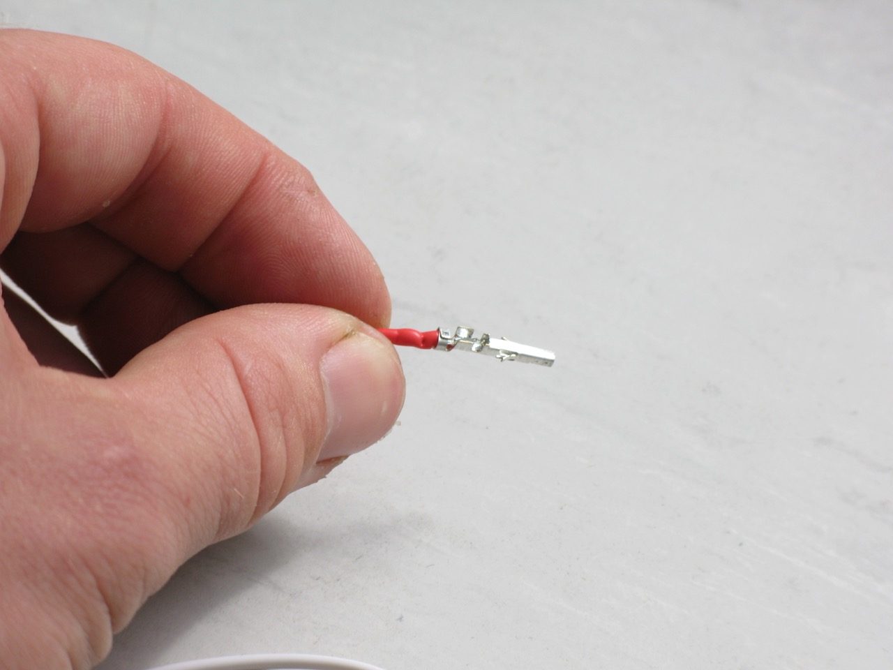

### Wiring Connectors

We have suggested to use 4-pin mini molex connectors to connect the lights to the light switching circuit and 2-pin molex (size up from mini) connectors to connect the light switching circuit to a 12v power supply. This makes connecting/reconnecting the lights and power supply easy and reduces the chance that a user will connect the terminals incorrectly (the connectors can only be inserted one way). However, they can be tricky to install (common problems are listed at step 7). There are endless [other connectors](https://www.sparkfun.com/categories/91) if alternatives are needed/preferred.

1. Strip the ends of the eight LED wires (4 from the LED housing and 4 from the illumination foot) leaving around 4mm of exposed wire. Only four of the eight wires are shown in the picture.

    

2. You can attach the wire to the pins using a crimping tool but a soldered connection is better. Do one pin at a time. Insert the wire part way into the pin as shown below and use a third hand clip to secure the wire to the pin while soldering.

    (picture required)

3. Add a small amount of solder to the tip of the soldering iron then push the tip into the pin so the solder touches the exposed wire (which is touching the pin). Leave for a brief moment so the iron (via the little bit of solder) heats the wires and pin. Now add more solder. The solder should flow in and around the wires. As soon as it does the remove the soldering iron. If the pin gets too hot then the wire insulation will melt, so the trick is to have the soldering iron heating the pin long enough so enough solder is added ensuring a good connection but not so long that the wire insulation melts and becomes a mess (it always melts a little). Make sure the solder stays within the pin channel. If you're having problems later inserting the pin into housing then this could be the problem. 

    
    

4. Remove the pin from the third hand clip (be careful it will be hot) and remove the unnecessary flap of metal at the base.

    

5. With the small needle-nose pliers fold the two flaps of metal inwards to hold the wire (alternatively crimp using a crimping tool).

    
    

6. Repeat for the remaining wires and pins, but only for the male or female connector, whichever you chose. Keep the partner for later.

7. Insert the pins one at a time into the housing. These can only go in one way but might need a little extra push with the pliers to get them to clip all the way in. If they're not going in, possible causes might be:

    * Too much solder has been applied to the wire 
    * There is solder outside the channel where the wire sits
    * The wire is soldered too far in to pin
    * The pin is bent/deformed
    * The two little flaps on the side of the pin that clip into a groove in the housing and lock the pin in place have been damaged/deformed.

    It doesn't take much pin damage for it to be difficult/impossible to get these mini-molex pins into the housing. Unfortunately in most cases you just need to start again with a new set of connectors. The larger molex connectors are easier and have a more obvious 'click' when you insert the pin into the housing, but for the mini version you just need to ensure that the pin is all the way in and can't be pulled out when you try (but don't pull too hard!).

    

8. Done!